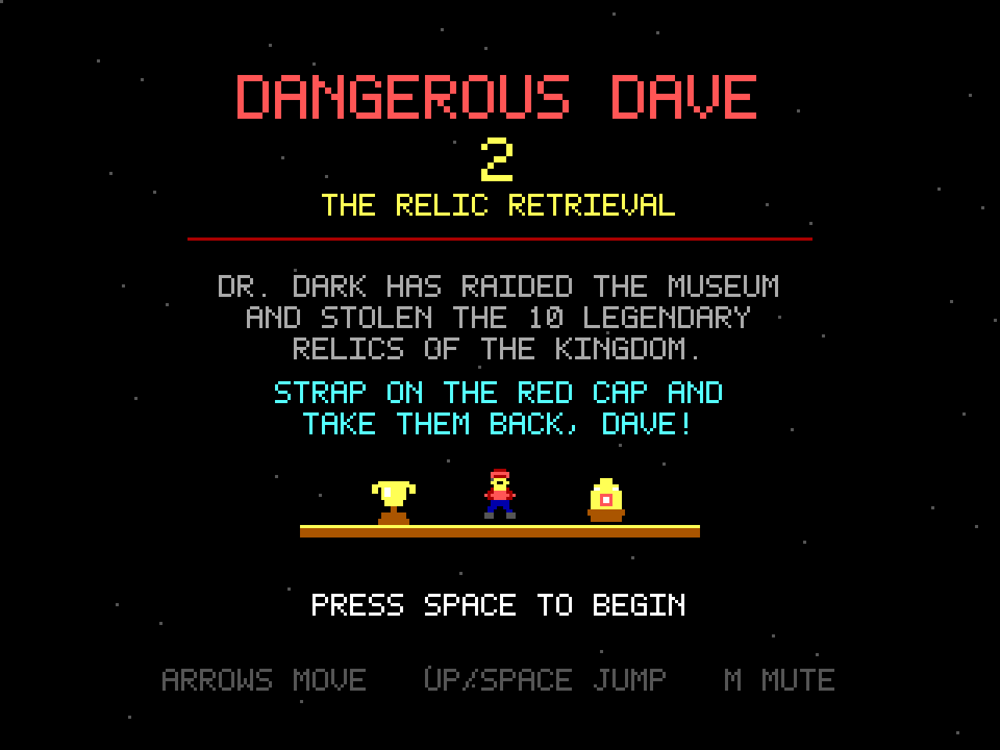
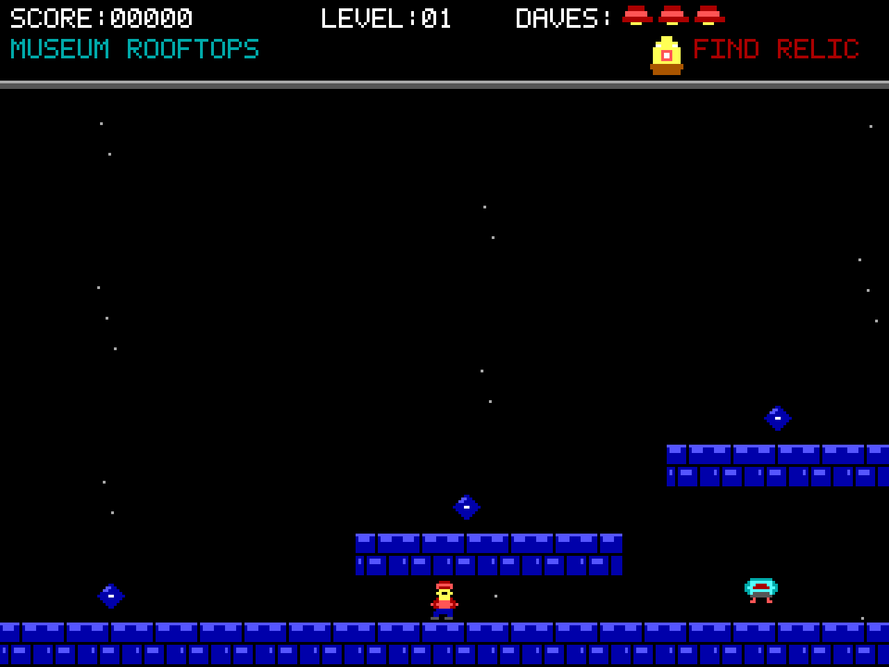
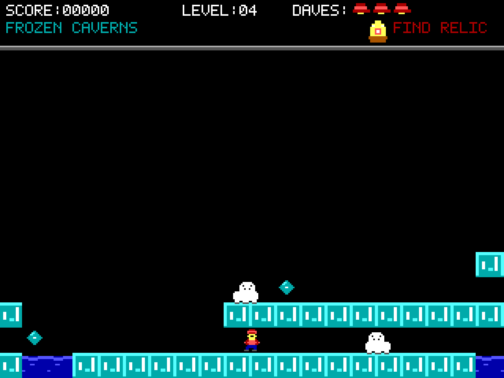
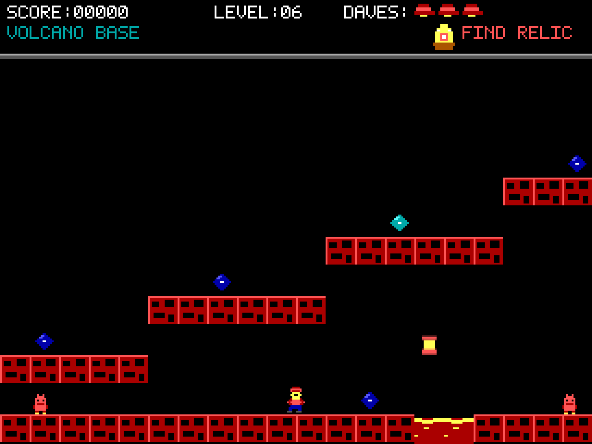
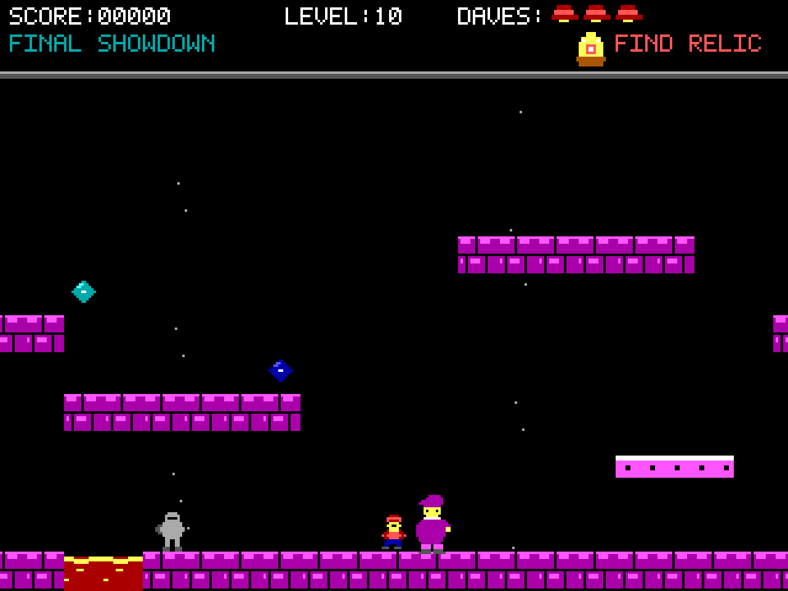

# Dangerous Dave 2: The Relic Retrieval

A browser-based sequel to the 1988 DOS platformer *Dangerous Dave*, written as a
single self-contained HTML file — and wrapped in a tiny native macOS app.

Dr. Dark has raided the town museum and stolen the ten legendary relics of the
kingdom. Dave straps the red cap back on to get them home.

**No dependencies, no external assets, no build step for the game.** Every sprite
and tile is pixel art drawn to a Canvas at runtime, and every sound is
synthesised with the Web Audio API. The whole game is one `index.html`.



---

## Play it

**In a browser** — open the file. That's it.

```bash
open index.html
```

**On macOS** — grab the app from the
[latest release](https://github.com/abhijith-satheesh-rao/dangerous-dave-2/releases/latest),
unzip it and double-click.

> The bundle is **ad-hoc signed**, so on a machine that didn't build it macOS
> will refuse to open it on the first try. Right-click the app and choose
> **Open**, then confirm — you only need to do this once. Or build it yourself,
> see [Building the macOS app](#building-the-macos-app).

### Controls

| Key | Action |
| --- | --- |
| <kbd>←</kbd> <kbd>→</kbd> | Move |
| <kbd>↑</kbd> or <kbd>Space</kbd> | Jump (hold longer to jump higher) |
| <kbd>R</kbd> | Restart the current level |
| <kbd>M</kbd> | Mute |

Collect the **relic** on each level to unlock the exit door, then walk through it.

| Pickup | Points |
| --- | --- |
| Diamond | 100 |
| Trophy | 500 |
| Relic | 1000 |
| Reaching the exit | 250 |
| Defeating Dr. Dark | 2000 |

Touching an enemy or a hazard costs a life, as does falling too far without a
platform to break the fall.

---

## The ten levels

| # | Level | Enemy | Hazard / mechanic |
| --- | --- | --- | --- |
| 1 | Museum Rooftops | Security drones | Night rooftops |
| 2 | City Sewers | Rats | Toxic water pools |
| 3 | Haunted Forest | Floating ghosts | Spike beds |
| 4 | Frozen Caverns | Polar bears | Slippery ice physics |
| 5 | Desert Ruins | Scorpions | Quicksand |
| 6 | Volcano Base | Fire imps | Lava and rising fireballs |
| 7 | Sky Fortress | Mini-airships | Bottomless gaps |
| 8 | Clockwork Tower | Clockwork spiders | Moving platforms |
| 9 | Dr. Dark's Castle | Knights | Falling chandeliers |
| 10 | Final Showdown | **Dr. Dark** | Everything at once |

Dr. Dark paces his hall throwing dark orbs and must be jumped on three times. He
drops the tenth relic when he falls.

| | |
| :---: | :---: |
|  |  |
| **1 — Museum Rooftops.** Hovering security drones. | **4 — Frozen Caverns.** Polar bears and slippery ice. |
|  |  |
| **6 — Volcano Base.** Lava pits and rising fireballs. | **10 — Final Showdown.** Dr. Dark himself. |

---

## How it's built

| | |
| --- | --- |
| Resolution | 320×240 internal, integer-scaled with `image-rendering: pixelated` |
| Palette | The 16 EGA colours, strictly |
| Graphics | Sprites defined as text grids, baked once to offscreen canvases |
| Audio | Web Audio oscillators and noise buffers — jumps, pickups, death, jingles |
| Physics | Fixed gravity, variable-height jumps, coyote time, input buffering |
| Collision | AABB resolved one axis at a time, so corners never wedge Dave into a tile |
| Levels | Tile maps authored as character grids, 13 rows tall |
| Loop | `requestAnimationFrame` with delta timing, clamped so a background tab can't tunnel through geometry |

States: title, playing, dying, level transition, game over, victory.

---

## Dev / testing mode

A level selector on the title screen lets you jump straight to any level instead
of playing through. It is **hidden by default** and can be enabled three ways:

| Where | How |
| --- | --- |
| Anywhere | Type `DEV` on the title screen to toggle it |
| Browser | Add `?dev=1` (or `#dev`) to the URL |
| macOS app | **Developer ▸ Level Select** (<kbd>⇧⌘D</kbd>), or launch with `--dev` |

With it on, <kbd>←</kbd>/<kbd>→</kbd> step through levels and <kbd>1</kbd>–<kbd>9</kbd>
(<kbd>0</kbd> for level 10) jump directly. A `DEV MODE` badge appears on the title
screen and a `DEV` tag in the HUD, so a test run is never mistaken for a real one.

With it off, the picker keys are completely inert and a run always starts at
level 1. The macOS app remembers the setting between launches.

---

## Building the macOS app

Produces `DangerousDave2.app` — a ~600 KB universal (arm64 + x86_64) bundle that
hosts the game in a `WKWebView`. There is no Xcode project: a single Swift file
is compiled with `swiftc` and the bundle is assembled by hand.

**Requirements:** the Xcode Command Line Tools (`xcode-select --install`). No
Xcode, no Rust, no Node.

```bash
./mac/build.sh
```

The script generates the app icon, compiles both architectures, bundles
`index.html` as a resource, writes the `Info.plist`, and ad-hoc signs the result
so it runs on Apple Silicon without a developer account.

> **Note on SDKs.** The Command Line Tools sometimes ship an SDK newer than their
> own `swiftc`, which fails to build anything. `build.sh` probes for the newest
> SDK the installed compiler actually accepts and reports which one it picked.

### Verifying a build

The app has a self-test that boots the real `WKWebView`, exercises the game
inside it and prints a report — useful for checking a build headlessly.

```bash
./DangerousDave2.app/Contents/MacOS/DangerousDave2 --selftest
```

It checks that all ten levels load, Canvas 2D works, nearest-neighbour scaling is
applied, an `AudioContext` can be created, Dave lands without clipping, the
relic unlocks the door, and — the usual failure mode for a WebView wrapper — that
keystrokes actually reach the page.

---

## Project layout

```
index.html           The entire game
mac/main.swift       Native shell: window, menu bar, dev-mode toggle, self-test
mac/makeicon.swift   Draws the app icon and emits the .iconset at build time
mac/build.sh         Compiles and assembles DangerousDave2.app
```

`DangerousDave2.app` is a build artifact and is not tracked — run `./mac/build.sh`
to produce it.

---

## Notes

The macOS bundle is **ad-hoc signed for personal use**. It runs fine on the
machine that built it. Distributing it to anyone else would need an Apple
Developer account for signing and notarisation, otherwise Gatekeeper will block
it as coming from an unidentified developer.
